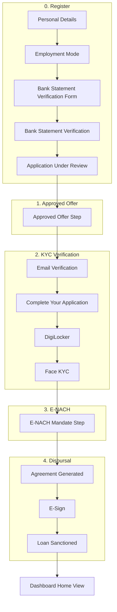

# Application Flow

End-to-end flow for the credit/loan application (dashboard).

---

## Main steps (progress bar)

| # | Step name              | Store: `currentStep` |
|---|------------------------|----------------------|
| 0 | Register                | 0                    |
| 1 | Approved Offer          | 1                    |
| 2 | KYC Verification       | 2                    |
| 3 | E-NACH Mandate Setup   | 3                    |
| 4 | Disbursal              | 4                    |

---

## 1. Register (`currentStep === 0`)

| Sub-step | Store: `registerSubStep` | Screen / component                  |
|----------|---------------------------|-------------------------------------|
| 0        | 0                         | **PersonalDetailsForm** (PAN, DOB, income, pincode) |
| 1        | 1                         | **EmploymentModeForm** (salaried / self-employed)  |
| 2        | 2                         | **SoftPullScreen** \| **BSAMobileScreen** \| **LoanOfferScreen** \| **ApplicationUnderReviewScreen** (per `registerFlowState`) |
| 4        | 4                         | **ApplicationUnderReview** → “View Offer” → goes to Approved Offer |

**registerFlowState** when `registerSubStep === 2`: `soft_pull` → SoftPullScreen, `bsa` → BSAMobileScreen, `offer` → LoanOfferScreen (+ "Update via BSA" when `showUpdateButton`), `under_review` → ApplicationUnderReviewScreen.

**Back:** Available on sub-steps 0–1 (not on registerSubStep 2).

---

## 2. Approved Offer (`currentStep === 1`)

| Sub-step | Screen / component   |
|----------|----------------------|
| —        | **LoanOfferScreen** (offer + Download / Update via BSA → next step) |

---

## 3. KYC Verification (`currentStep === 2`)

| Sub-step | Store: `kycSubStep` | Screen / component                         |
|----------|---------------------|-------------------------------------------|
| 0        | 0                   | **EmailVerificationStep** (email + OTP)   |
| 1        | 1                   | **PersonalFamilyDetailsStep** (“Complete Your Application”) |
| 2        | 2                   | **DigiLockerStep** (DigiLocker docs)      |
| 3        | 3                   | **FaceKYCStep** → Continue opens **KYC completed modal** |

**Modal:** Closing the KYC completed modal → `completeKycGoToEnach()` → move to E-NACH.

**Back:** Available on KYC sub-steps 1–3. “Back from E-NACH” returns to KYC sub-step 3 (Face KYC).

---

## 4. E-NACH Mandate Setup (`currentStep === 3`)

| Sub-step | Screen / component   |
|----------|----------------------|
| —        | **ENachMandateStep** (“Setup E-NACH” → next step) |

**Back:** Returns to KYC (sub-step 3 – Face KYC).

---

## 5. Disbursal (`currentStep === 4`)

| Sub-step | Store: `disbursalSubStep` | Screen / component            |
|----------|---------------------------|------------------------------|
| 0        | 0                         | **AgreementGeneratedStep**    |
| 1        | 1                         | **ESignStep**                |
| 2        | 2                         | **LoanSanctionedStep** (“Login to Dashboard” → sets `applicationCompleted = true`) |

**Back:** Available on sub-steps 0–1 (not on Loan Sanctioned).

---

## After flow completion

- When **LoanSanctionedStep** → “Login to Dashboard” is clicked: `setApplicationCompleted(true)`.
- Dashboard then shows **DashboardHomeView** instead of the step flow.
- **DashboardHomeView** has “Continue” which sets `setApplicationCompleted(false)` to re-enter the flow.

---

## Visual (Mermaid)

---

*Generated from `app/(app)/personal-loan/page.tsx` and `store/useFlowStore.ts`.*
